# Git and GitHub Onboarding Guide for New Interns

## Basics of Git and GitHub

### What is Git?

Git is a distributed version control system that helps developers track changes in their code, collaborate with team members, and maintain a history of project versions.

### What is GitHub?

GitHub is a web-based platform for hosting Git repositories.It enhances team collaboration by:

- Allowing developers to share code securely.
- Providing tools for version control, code reviews, and pull requests.

## Installation and Setup

### Installing Git

#### On Windows:

1. Download Git for Windows from the official website: [https://git-scm.com](https://git-scm.com).
2. Run the installer and follow the setup wizard.
3. Choose the default options unless specific customizations are required.
4. Verify the installation by opening `Command Prompt` and running:
   ```bash
   git --version
   ```
   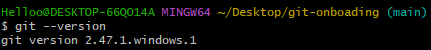

#### On macOS:

1. Open Terminal.
2. Install Git using Homebrew:
   ```bash
   brew install git
   ```
3. Verify the installation:
   ```bash
   git --version
   ```
   

#### On Linux:

1. Open the terminal.
2. Install Git using the package manager for your distribution:
   ```bash
   sudo apt update
   sudo apt install git       # For Ubuntu/Debian
   sudo yum install git       # For CentOS/Fedora
   ```
3. Verify the installation:
   ```bash
   git --version
   ```
   

### Configuring Git

After installing Git, configure your name and email:

```bash
git config --global user.name "Your Name"
git config --global user.email "your.email@example.com"
```

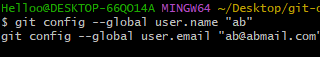

Checking name and email:

```bash
git config --global user.name
git config --global user.email
```

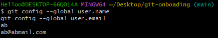

### Creating a GitHub Account

1. Visit [https://github.com](https://github.com).
2. Click **Sign up** and fill out the registration form.
3. Verify your email address and log in to your new account.

## Creating a Repository on Github

### Steps to create new repository

1. After signing up, click on new button or select `new repository` for creating new repository:

   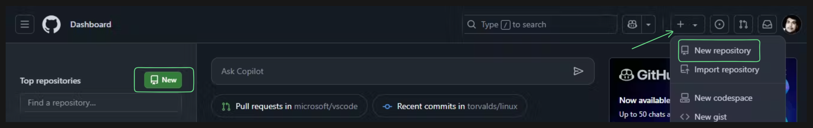

2. Fill the detials regarding repository name, description, repository visibility:

   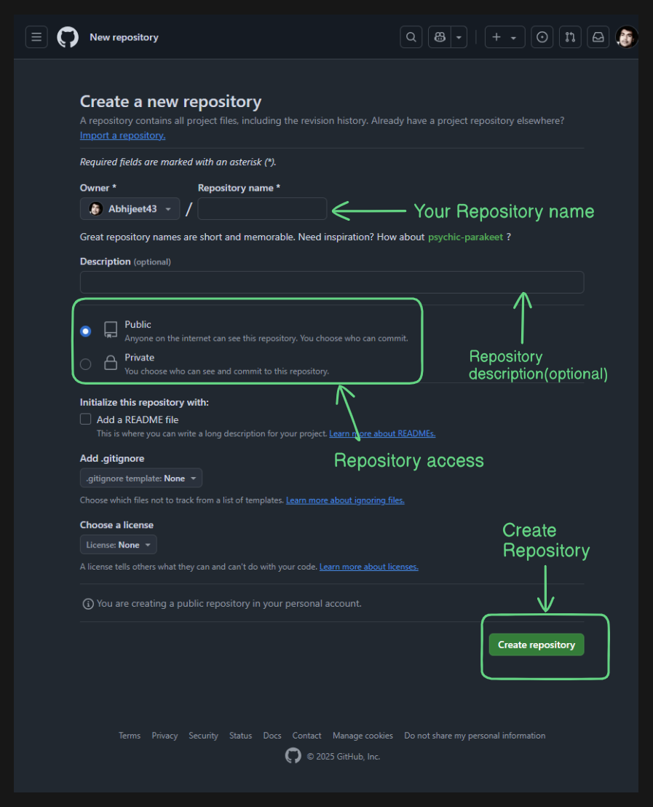

## Making Your First Commit and Push

### Steps to Make Your First Commit

1. **Initialising Git:**

   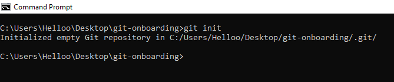

   This will initialise git in your project so that versioning starts.

2. **Check the Repository Status:**

   ```bash
   git status
   ```

   This will show the modified and untracked files.

   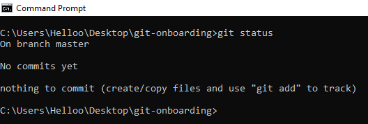

3. **Stage Your Changes:**
   Add the changes to the staging area:

   ```bash
   git add <file>
   git add .   # Stages all changes
   ```

   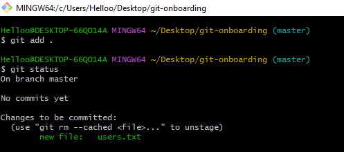

4. **Commit Your Changes:**
   Commit the staged changes with a meaningful message:

   ```bash
   git commit -m "feat: Add initial project setup"
   ```

   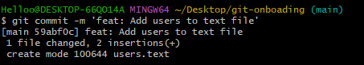

### Push Changes to Remote Repository

1. Change name of master to main(if required):

   ```bash
   git branch -M main
   ```

   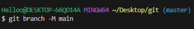

2. Set remote where file needs to be pushed:

   ```bash
   git remote add origin <github_repository_url>
   ```

   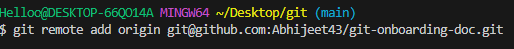

3. Push your commit to the GitHub repository:

   ```bash
   git push origin main
   ```

   Replace `main` with the branch name if you are working on a different branch.

4. If this is your first push for the branch, you might need to set the upstream:
   ```bash
   git push -u origin main
   ```
   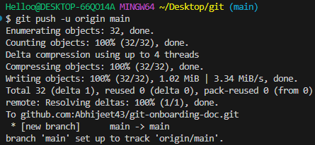

## Cloning a GIT Repository

### Steps to Clone a Repository

1. Copy Git URL of Repository that needs to be cloned:

   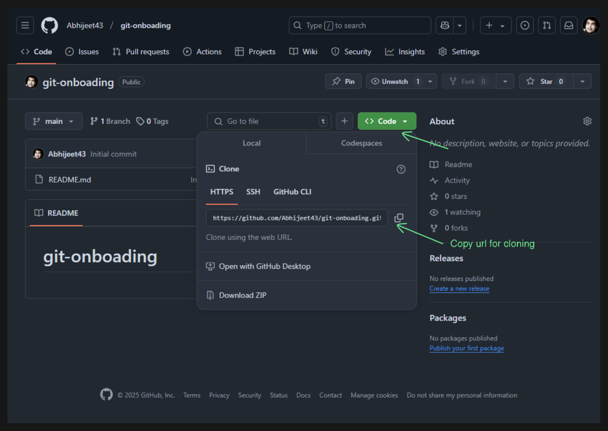

2. Open Terminal (or Command Prompt/PowerShell/Git Bash on Windows).

   1. Run the following command to clone the repository:
      ```bash
      git clone <repo_url>
      ```
      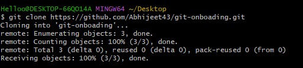
   2. Navigate into the cloned repository folder:
      ```bash
      cd <repo_name>
      ```
      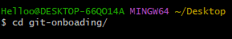

## Basic Git Commands

### Common Commands and Their Usage

1.  **Initialise git repository:**

    ```bash
    git init
    ```

    

2.  **Check repository status:**

    ```bash
    git status
    ```

    
    Displays changes, staged files, and untracked files.

3.  **Stage changes for commit:**

    ```bash
    git add <file>
    git add .    # Stages all changes
    ```

    

4.  **Commit staged changes:**

    ```bash
    git commit -m "Commit message"
    ```

    

5.  **Push changes to the remote repository:**

    ```bash
    git push
    ```

    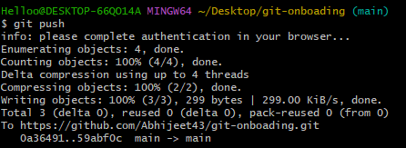

6.  **Pull changes from the remote repository:**

    ```bash
    git pull
    ```

    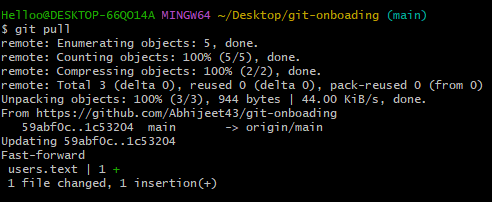

7.  **View commit history:**
    ```bash
    git log
    ```
    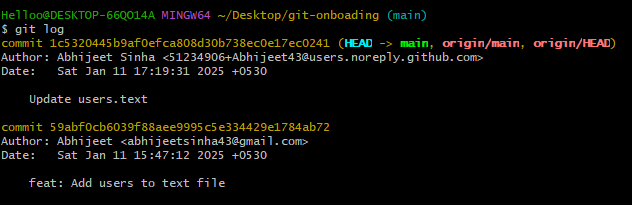

## Commit Message Rules

To maintain clear and consistent commit history, follow these rules:

- Use the **present tense** (e.g., "Add feature" instead of "Added feature").
- Capitalize the **first letter**.
- Keep the message concise (**50 characters or less**).
- Use **prefixes** to categorize changes:
  - `feat:` for new features.
  - `fix:` for bug fixes.
  - `chore:` for maintenance tasks.
  - `docs:` for documentation updates.
  - `update:` for code updates

### Examples

```bash
feat: Add tea selection feature
fix: Resolve login issue for tea enthusiasts
docs: Update README with chai varieties
```


## Branching Workflow

### Branching Strategy at ChaiCode

- **`main` branch:** Contains the stable, production-ready code.
- **`development` branch:** Used for integrating features before merging into `main`.
- **Feature branches:** Created for individual tasks or features (e.g., `feature/tea-menu`).

### Creating and Switching Branches

1. Create a new branch:
   ```bash
   git branch <branch-name>
   ```
   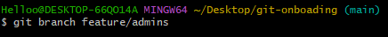
2. Switch to the new branch:
   ```bash
   git switch <branch-name>
   ```
   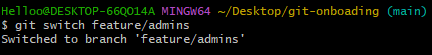

- Both above steps can be done with this command as well `git switch -c <branch-name>`

### Merging Branches and Resolving Conflicts

1. Merge a branch into `development`:
   ```bash
   git switch <branch-name>
   git merge <branch-name>
   ```
   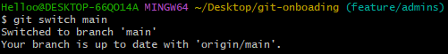
   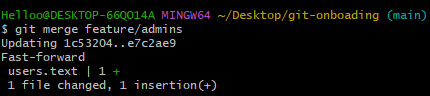
2. Resolve conflicts in the affected files, then stage and commit the changes:
   ```bash
   git add .
   git commit -m "Resolve merge conflicts"
   ```

## Pull Requests (PR)

### Creating a Pull Request

1. Push your feature branch to GitHub:

   ```bash
   git push -u origin <branch-name>
   ```

   

2. Go to the repository on GitHub and click **Pull Requests** and click **New Pull Request** and select your branch..

   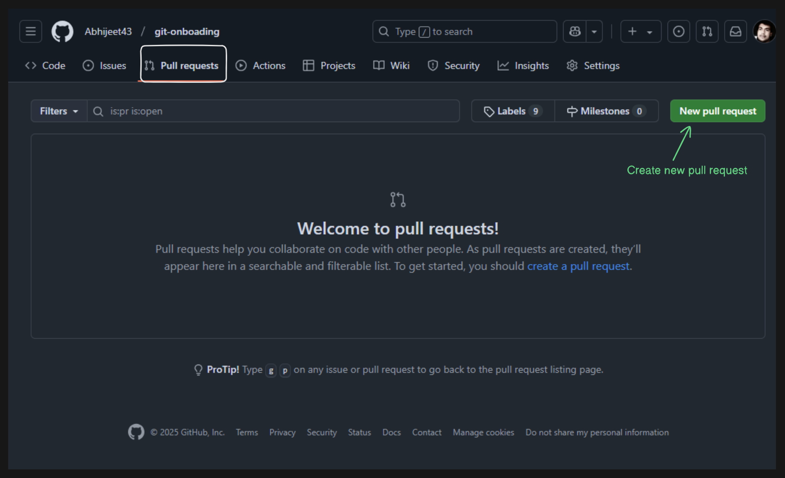

3. Write a detailed description of the changes:
   - Purpose of the change.
   - Any relevant issue numbers.
   - Screenshots or testing steps if applicable.

### Guidelines for PR Descriptions

- Be clear and concise.
- Reference relevant issues (e.g., "Fixes #123").
- Request a code review from a team member.

## Best Practices

### Regular Commits

- Commit changes frequently to ensure progress is saved incrementally.
- Avoid committing large, unrelated changes in one commit.

### Descriptive Commit Messages

- Use meaningful and descriptive commit messages to clarify the intent of each change.
- Follow the commit message rules outlined above.

### Pull Updates Regularly

- Frequently pull updates from the remote repository to stay in sync with the latest changes.
- Pulling regularly minimizes merge conflicts and helps maintain a smooth workflow.

By following this guide, you will efficiently collaborate with the team and maintain best practices in Git and GitHub usage.
